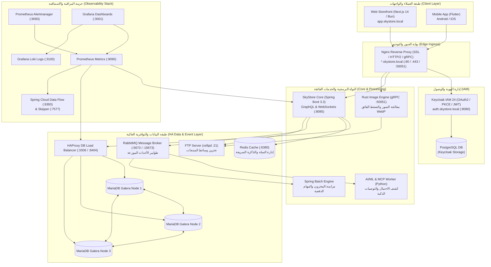

# 🛒 SkyStore - المنظومة السحابية المتكاملة للتجارة الإلكترونية
### Enterprise E-Commerce Platform (Polyglot Microservices & HA Architecture)

[](https://spring.io/projects/spring-boot)
[](https://graphql.org/)
[](https://www.rust-lang.org/)
[](https://nextjs.org/)
[](https://bun.sh/)
[](https://mariadb.com/)
[](https://podman.io/)
[](https://www.keycloak.org/)
[](https://prometheus.io/)
[](https://grafana.com/)

منظومة تجارة إلكترونية سحابية متقدمة وموزعة، مصممة وفق معمارية **الخدمات المصغرة الهجينة (Polyglot Modular Monolith & Microservices)** الموجهة بالأحداث، تجمع بين سرعة واستقرار **Java (Spring Boot 3.3)**، والأداء الفائق لمحرك **Rust (gRPC)**، وذكاء **Python (AI Worker)**، مع واجهات ويب تفاعلية بـ **Next.js (Bun)** وتطبيقات هواتف بـ **Flutter**، وبنية تحتية عالية التوافرية (**High Availability**).

---

## 🏛️ 1. المخطط المعماري المعتمد وتدفق البيانات (System Architecture)



### أدوار الطبقات الأساسية:
- **بوابة العبور والتوجيه (Edge Ingress):** خادم Nginx يدير إنهاء التشفير (SSL Termination) وتمرير البروتوكولات الثلاثة: HTTPS لاستعلامات GraphQL، وWSS لاتصالات WebSockets، وHTTP/2 لاتصالات gRPC.
- **إدارة الهوية والوصول (IAM):** خادم Keycloak يعتمد تدفق Authorization Code with PKCE لتأمين تطبيقات الويب والهاتف وإصدار رموز JWT مشفرة.
- **النواة البرمجية (Core Monolith):** تطبيق Spring Boot 3 يدير منطق الأعمال للمنتجات، والطلبات، والمستودعات، والشحن، والتكامل مع الدفعات عبر Spring Batch.
- **محرك الوسائط الفائق (Rust Media Engine):** خدمة ثنائية بلغة Rust تستقبل تدفقات الصور الخام عبر gRPC وتقوم بضغطها بصيغة WebP بنسبة تقليص تتجاوز 93% ثم رفعها عبر FTP.
- **الذكاء الاصطناعي وخادم السياق (AI/ML & MCP):** نماذج كشف الاحتيال والمطابقة الهجينة للتوصيات، متصلة بنواة الحاويات وأدوات الفحص عبر معيار FastMCP.
- **طبقة البيانات والتوافرية العالية (HA Data Layer):** عنقود MariaDB Galera ثلاثي العقد (Active-Active Multi-Master) يعمل خلف موازن أحمال HAProxy لمنع نقطة الفشل الفردية.
- **حزمة المراقبة والاستباقية (Observability Stack):** رصد المقاييس عبر Prometheus، وإدارة التنبيهات عبر Alertmanager، وتجميع السجلات عبر Loki، وأوركسترا البيانات عبر Spring Cloud Data Flow، مع واجهات موحدة في Grafana.

---

## 🧩 2. جدول المكونات، المنافذ، والاعتماديات التشغيلية (Services Breakdown)

| الخدمة / الحاوية | البيئة / الإطار | المنفذ الداخلي | المنفذ الخارجي / الرابط | الاعتماديات الأساسية |
| :--- | :--- | :--- | :--- | :--- |
| **`skystore-web`** | Next.js 14 / Bun | `3000` | [`https://app.skystore.local`](https://app.skystore.local) | `skystore-core`، `keycloak` |
| **`nginx`** | Nginx Alpine | `80`, `443`, `50051` | [`https://api.skystore.local`](https://api.skystore.local) | كافة الخدمات الخلفية |
| **`skystore-keycloak`** | Keycloak 24 / OpenJDK | `8080` | [`https://auth.skystore.local`](https://auth.skystore.local) | `skystore-postgres` |
| **`skystore-core`** | Spring Boot 3.3 / Java 21 | `8085` | شبكة داخلية (`skystore-net`) | `mariadb-lb`، `redis`، `rabbitmq` |
| **`skystore-rust-engine`** | Rust / Tonic (gRPC) | `50051` | `grpc://grpc.skystore.local:50051` | لا توجد |
| **`skystore-ai-worker`** | Python / FastMCP / Pika | خلفي | مستمع AMQP | `rabbitmq`، `podman.sock` |
| **`skystore-mariadb-lb`** | HAProxy 2.9 | `3306`, `8404` | `3306` (SQL), `8404` (Stats) | عقد Galera الثلاث (`node1, 2, 3`) |
| **`skystore-mariadb-node1,2,3`** | MariaDB Galera 11.4 | `3306`, `4567`, `4568` | شبكة داخلية (`skystore-net`) | تزامن شبكي متبادل (Galera SST) |
| **`skystore-redis`** | Redis 7 Alpine | `6379` | `6380` | لا توجد |
| **`skystore-rabbitmq`** | RabbitMQ 3 Management | `5672`, `15672` | `5673` (AMQP), `15673` (UI) | لا توجد |
| **`skystore-ftp`** | vsftpd | `21`, `21100-21110` | `21` (FTP Command) | وحدة تخزين `ftp_data` |
| **`skystore-dataflow`** | Spring Cloud Data Flow | `9393` | `http://localhost:9393` | `skystore-skipper`, `mariadb-lb` |
| **`skystore-prometheus`** | Prometheus v2.52 | `9090` | `http://localhost:9090` | مستكشفات Actuator و HAProxy |
| **`skystore-alertmanager`** | Alertmanager v0.27 | `9093` | `http://localhost:9093` | `prometheus` |
| **`skystore-loki`** | Grafana Loki 3.0 | `3100` | `http://localhost:3100` | وحدات السجلات |
| **`skystore-grafana`** | Grafana 11.0 | `3000` | `http://localhost:3001` | `prometheus`, `loki` |

---

## 🛠️ 3. دليل التشغيل، الإدارة، والصيانة اليومية (Operations Playbook)

### أولاً: بدء وإيقاف المنظومة بالكامل
يتم تنفيذ الأوامر من المسار الرئيسي للمشروع على خادم Fedora أو داخل بيئة Podman:

- **تشغيل كافة الخدمات في الخلفية:**
  ```bash
  cd skystore
  podman compose up -d
  ```

- **إيقاف المنظومة بالكامل مع الحفاظ على البيانات:**
  ```bash
  podman compose stop
  ```

- **إعادة تشغيل خدمة منفردة (مثال: محرك Rust أو النواة):**
  ```bash
  podman compose restart rust-engine skystore-core
  ```

---

### ثانياً: استعادة عنقود MariaDB Galera عند الانهيار الكامل (Cluster Bootstrap Recovery)
في حال انقطاع التيار الكهربائي أو إيقاف كافة الخوادم قسرياً، قد يفقد العنقود معرفة العقدة الأكثر حداثة:

1. **تحديد العقدة ذات أحدث تسلسل بيانات (Highest Sequence Number):**
   افحص ملف `grastate.dat` داخل وحدات التخزين:
   ```bash
   sudo cat /home/user/.local/share/containers/storage/volumes/skystore_galera_node1_data/_data/grastate.dat | grep -E "seqno|safe_to_bootstrap"
   ```

2. **تجهيز العقدة للإقلاع الأولي (Safe to Bootstrap):**
   في العقدة التي تحوي أعلى `seqno` (أو العقدة الأساسية node1)، اضبط المعامل داخل ملف `grastate.dat`:
   ```bash
   sudo sed -i 's/safe_to_bootstrap: 0/safe_to_bootstrap: 1/' /home/user/.local/share/containers/storage/volumes/skystore_galera_node1_data/_data/grastate.dat
   ```

3. **بدء العنقود من جديد:**
   - شغّل العقدة الأولى أولاً بمفردها:
     ```bash
     podman compose up -d mariadb-galera-node1
     ```
   - تحقق من استقرارها، ثم أطلق العقدتين المتبقيتين وموازن الأحمال:
     ```bash
     podman compose up -d mariadb-galera-node2 mariadb-galera-node3 haproxy
     ```

4. **التأكد من اكتمال العنقود:**
   ```bash
   podman exec skystore-mariadb-node1 mariadb -u sky_user -psky_secure_pass -e "SHOW STATUS LIKE 'wsrep_cluster_size'; SHOW STATUS LIKE 'wsrep_cluster_status';"
   # يجب أن تكون النتيجة: wsrep_cluster_size = 3 | wsrep_cluster_status = Primary
   ```

---

### ثالثاً: خطط النسخ الاحتياطي والاستعادة (Backup & Recovery)

1. **النسخ الاحتياطي لقواعد البيانات (MariaDB Hot Backup):**
   يتم أخذ نسخة متزامنة دون إيقاف الخدمات عبر الاستعلام من خلال موازن الأحمال:
   ```bash
   podman exec skystore-haproxy mariadb-dump -h 127.0.0.1 -P 3306 -u sky_user -psky_secure_pass \
     --single-transaction --routines --triggers --databases skystore_db > /opt/backups/skystore_db_$(date +%F_%H%M).sql
   ```

2. **النسخ الاحتياطي لخادم الهوية (Keycloak DB):**
   ```bash
   podman exec skystore-postgres pg_dump -U keycloak_user keycloak_db > /opt/backups/keycloak_db_$(date +%F_%H%M).sql
   ```

3. **النسخ الاحتياطي لوسائط التخزين (FTP Media Storage):**
   ```bash
   tar -czvf /opt/backups/ftp_media_$(date +%F_%H%M).tar.gz /home/vsftpd/sky_ftp/products/
   ```

---

## 🚨 4. تشخيص الأعطال والتعامل مع الطوارئ (Troubleshooting & Incident Response)

### المشكلة 1: استجابة خادم الويب بـ `502 Bad Gateway` عبر Nginx
- **التشخيص:** فحص ما إذا كانت حاوية `skystore-web` متوقفة أو منفذ Bun لا يستجيب:
  ```bash
  podman logs --tail 50 skystore-web
  ```
- **الإجراء:** التأكد من جاهزية خادم Standalone عبر `curl http://127.0.0.1:3000`، ثم إعادة تشغيل الحاوية:
  ```bash
  podman compose restart skystore-web
  ```

### المشكلة 2: فشل التحقق من جلسات المصادقة (Keycloak Unauthorized)
- **التشخيص:** فحص صلاحية الـ Client Secret وتزامن توقيت النظام (Clock Skew):
  ```bash
  podman logs --tail 100 skystore-keycloak
  ```
- **الإجراء:** التأكد من تطابق `KEYCLOAK_CLIENT_SECRET` في ملفات `.env.local` مع ما تم ضبطه في واجهة إدارة Keycloak، ومزامنة ساعة الخادم عبر `chronyd`.

### المشكلة 3: تراكم الرسائل في طابور الـ AMQP (RabbitMQ Bottleneck)
- **التشخيص:** فحص عدد الرسائل المنتظرة عبر واجهة الإدارة `http://localhost:15673` أو الأمر:
  ```bash
  podman exec skystore-rabbitmq rabbitmqctl list_queues name messages consumers
  ```
- **الإجراء:** إذا كان عدد المستهلكين (Consumers) لـ `ai.fraud.queue` أو `orders.queue` يساوي صفراً، قم بإعادة تشغيل معالج الذكاء الاصطناعي:
  ```bash
  podman compose restart ai-worker
  ```

### المشكلة 4: انخفاض أداء الاستعلامات أو بطء موازن قواعد البيانات
- **التشخيص:** فتح لوحة إحصائيات HAProxy على [`http://localhost:8404/stats`](http://localhost:8404/stats) والتحقق من حالة العقد (Health Checks).
- **الإجراء:** إذا ظهرت إحدى العقد باللون الأحمر (Down)، قم بفحص سجلاتها الداخلية عبر `podman logs skystore-mariadb-nodeX` للتأكد من حالة اتصال شبكة `skystore-net`.

---

## 🚀 5. إجراءات الترقية والنشر المستمر (Continuous Delivery Procedure)

يتم تحديث النظام آلياً عبر مسار GitHub Actions المعتمد بمجرد دمج التعديلات في فرع `main` أو `master`:

1. **فحوصات الجودة الآلية:** تُنفذ المنصة اختبارات الجودة لـ Java 21، ومحرك Rust، وتطبيقات Next.js عبر بيئة Bun.
2. **النشر التلقائي عبر SSH & Podman:** يتصل المسار بخادم Fedora عبر SSH لتنفيذ السحب وبناء الحاويات المستهدفة:
   ```bash
   podman compose build skystore-web skystore-core rust-engine
   podman compose up -d --no-deps skystore-web skystore-core rust-engine
   podman image prune -f
   ```
3. **التحقق النهائي من سلامة النظام بعد النشر:**
   - **فحص GraphQL:** [`https://api.skystore.local/graphql`](https://api.skystore.local/graphql)
   - **فحص المتجر:** [`https://app.skystore.local`](https://app.skystore.local)
   - **فحص مقاييس Prometheus:** [`http://localhost:9090/targets`](http://localhost:9090/targets)
